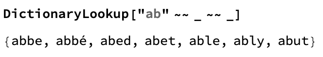
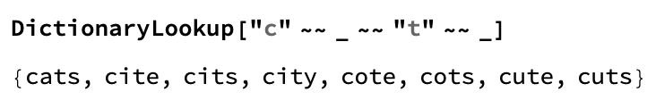

## Using the Dictionary

In this step, you'll learn how to use the dictionary in Wolfram, and how you need to structure your input in order to get results.

In Wolfram, we can use `DictionaryLookup` to find words in the dictionary. We can look up words in many different languages.

We can use `DictonaryLookup` to find a list of words which match a specific pattern. For example, we could find a list of the words in English, (the default language), which start with "ab" and have 4 letters.

Or we could find a list of all the words which start with "c", have "t" as the third letter, and are 4 letters in total.

--- task ---
Practice using `DictionaryLookup[]` with different letter patterns.
--- /task ---
