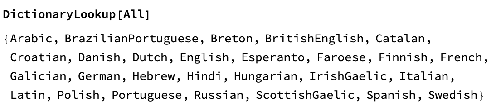

## How to use the dictionary

--- task ---
If you have never used the Wolfram Language before, follow [this guide to get started](https://projects.raspberrypi.org/en/projects/getting-started-with-mathematica) and learn to use the tool. Look at the sections **Starting Mathematica** and **Programming in Mathematica**.
--- /task ---

In this step, you'll learn:
+ How to use the dictionary in Wolfram
+ How to structure input in order to get results

In Wolfram, the command `DictionaryLookup` finds words in the dictionary. You can look up words in many different languages.

You can use `DictonaryLookup` to create a list of words that match a specific pattern. For example, you could create a list of words in English (the default language) that start with "ab" and have four letters.

Or you could create a list of all the words which start with "c", have "t" as the third letter, and are four letters long.

--- task ---
Use Wolfram to complete these words:

  + h_l_o 
  + r_s_ber_y
  + v_ca_ul_ry

--- hints ---
--- hint ---
Use `DictionaryLookup[]` to find possible solutions to these letter patterns.
--- /hint ---
--- /hints ---

--- /task ---
