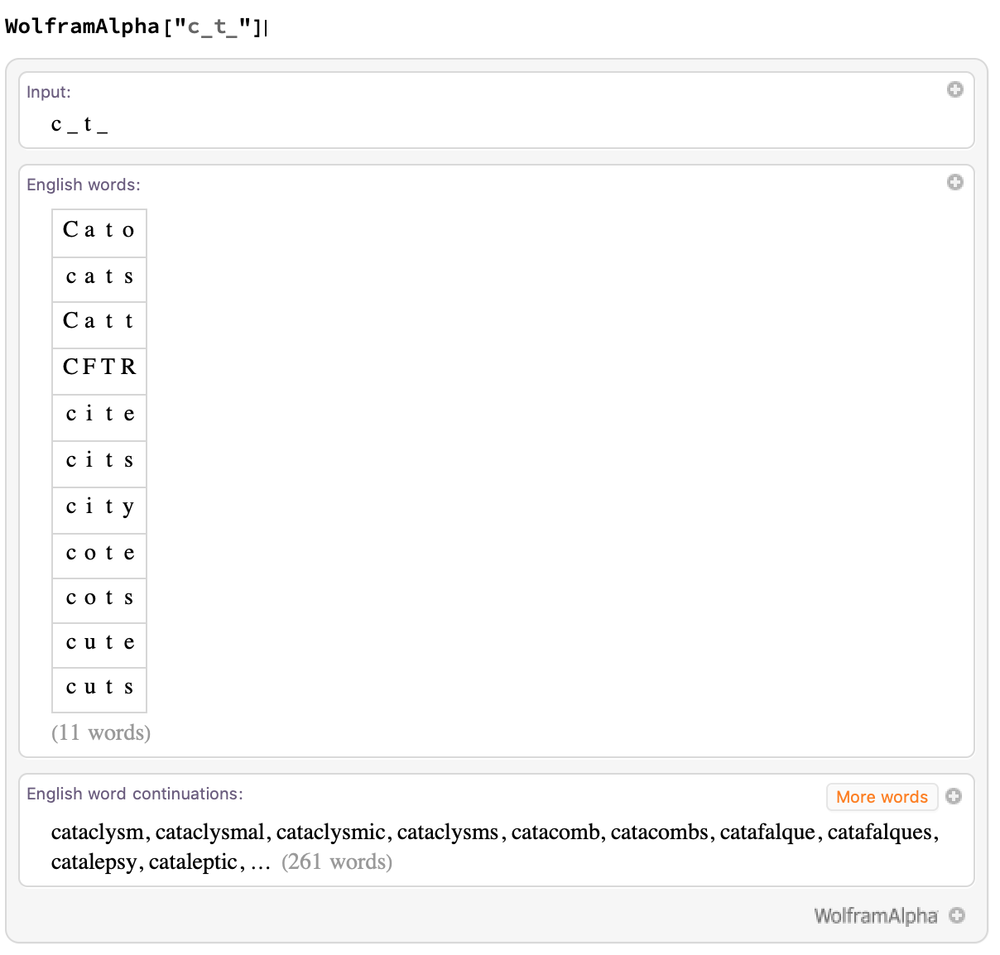
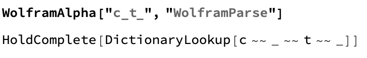
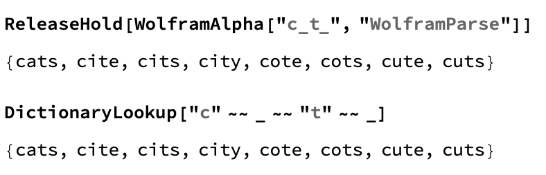

## Using Wolfram Alpha to Analyse Input

As we learned in the first step, in order to use `DictionaryLookup`, we have to have our input in a specific format. Each letter has to be interpreted as a string, with `""`, and each blank space, `_` needs to be its own expression.

Blanks cannot be strings.

We also noticed that each letter or blank is separated by `~~`. 

This is complicated, and could be difficult to code.

However, we can take a string and run it through `DictionaryLookup` without having to format it by using Wolfram Alpha's interpretation.

Wolfram Alpha is a knowledge engine created using the Wolfram language.

When we run a string through Wolfram Alpha, it returns a list of words which fit the pattern.

This is what we want to be able to recreate. We can access the code that Wolfram Alpha is running by using `"WolframParse"`.

So when we run a string through Wolfram Alpha, it's doing a `DictionaryLookup`, just like we did in the first step. But the code is on hold. `HoldComplete` means that the code hasn't been evaluated yet, 

We can evaluate it by using `ReleaseHold`.

You will notice that `ReleaseHold[WolframAlpha["c_t_", "WolframParse"]]` and `DictionaryLookup["c" ~~ _ ~~ "t" ~~ _]` give the exact same output. We will use the `WolframAlpha` code.